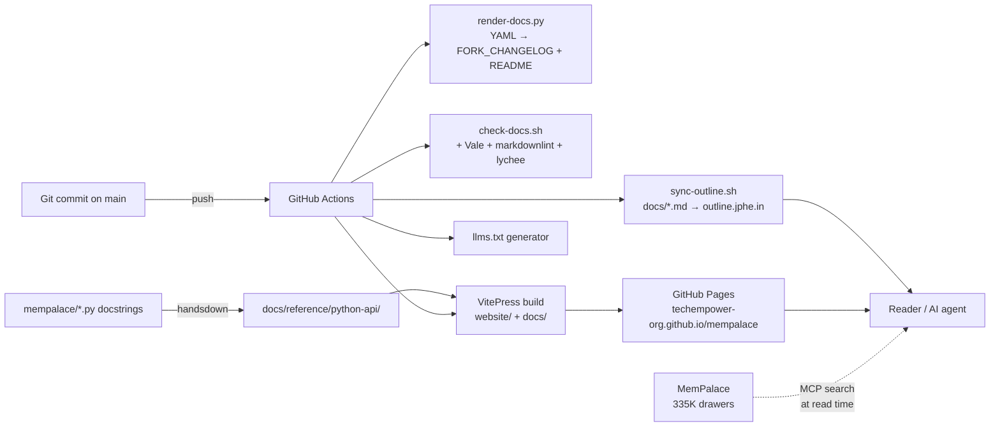

# Documentation Automation Survey (2026-05-24)

Research agent: Iris (team docs-automation-research). The aim is to identify the OSS tools — or combination — that will keep the fork's documentation comprehensive, beautiful, and continuously up-to-date with the codebase, without re-introducing the drift the fork-changes.yaml pipeline was built to prevent.

This is a survey, not a decision document. The recommended architecture at the bottom is the agent's best read of the landscape against the fork's actual constraints; the maintainer chooses the order of execution.

## TL;DR

1. **Adopt VitePress as the canonical doc site.** Upstream already ships a working VitePress site at `website/`; our `.github/workflows/deploy-docs.yml` already builds it. We are one bug away from shipping fork-aware docs on GitHub Pages — but we currently deploy on `develop` (upstream's branch name) so nothing renders on our `main`.
2. **Keep `docs/fork-changes.yaml` as the canonical changelog source.** Our renderer already beats every off-the-shelf changelog tool for our specific shape (fork-ahead with upstream PR linkage). Bolt on `git-cliff` only if we ever ship our own tags.
3. **Add Vale + markdownlint + lychee to CI.** Three small additions catch the entire "rotting docs" failure mode that `check-docs.sh` does not yet check (broken links, prose drift, structural Markdown errors).
4. **Outline sync is one cron job, not a project.** Reuse `~/.claude/scripts/outline-api.sh` from a nightly GitHub Action; do not adopt `outline-sync-action` because its bidirectional state in markdown frontmatter would conflict with our YAML-as-canonical-source model.
5. **AI doc generation is not a fit for this fork.** Mintlify / DocuWriter auto-update from PRs is exactly the wrong primitive for a verbatim-first project: it produces derivative summaries with no ground truth. Use MemPalace itself for the "AI memory of past sessions" surface; do not introduce a second LLM-summarized layer.

## Part 1 — Current state inventory

### What we have

**Generated artifacts** (canonical YAML → markdown):
- `docs/fork-changes.yaml` — canonical source. Schema documented in file header (`id`, `date`, `bucket`, `commit`, `area`, `summary`, `body`, `tests`, `pr`, `pr_state`, `files`).
- `scripts/render-docs.py` — renders `FORK_CHANGELOG.md` and the README fork-change-queue table (between `<!-- BEGIN/END FORK-QUEUE -->` markers). Supports `--check` for CI drift detection. CLAUDE.md + promises.md targets are stubbed.
- `scripts/check-docs.sh` — 4-step lint: README test count vs `pytest --collect-only`, fork commit hashes resolve via `git cat-file -e`, FORK_CHANGELOG.md re-render is idempotent, upstream PR states match doc claims via `gh pr view`.

**CI wiring:**
- `.github/workflows/check-docs.yml` — runs `check-docs.sh` on every PR/main push that touches the doc surface. Issue #65.
- `.github/workflows/deploy-docs.yml` — builds the `website/` VitePress site with Bun and deploys to GitHub Pages. **Triggers on `develop` only** — currently dormant on our fork's `main`.
- `.github/workflows/ci.yml`, `version-guard.yml` — orthogonal (tests, version bump).

**Doc tree (`docs/`, 9 top-level files + 12 subdirs):**
- Architectural: `ARCHITECTURE.md`, `BIBLIOGRAPHY.md`, `ECOSYSTEM.md`, `HISTORY.md`, `CLOSETS.md`
- Operational: `RELEASING.md`, `postgres_backend.md`, `format-coverage.md`, `virtual-line-numbering.md`, `operators/`, `recovery/`
- Decisions / research: `designs/`, `rfcs/`, `specs/`, `research/` (11 entries), `superpowers/` (plans+specs), `investigations/`, `internal/`, `fork-decisions/`
- Examples: `mempalace-config.yaml.example`, `schema.sql`, `benchmarks/` (JSON), `integrations/`
- Top-level repo: `README.md` (260 lines), `FORK_CHANGELOG.md` (1906 lines, generated), `CLAUDE.md` (153 lines).

**Inherited from upstream:**
- `website/` — VitePress site (Bun, vitepress 1.6, vitepress-plugin-mermaid, Vue 3.5). Three sections: `guide/`, `concepts/`, `reference/`. 23 markdown files. **Not currently authored by us** — we inherit upstream's content verbatim. The `.vitepress/config.mts` reads `DOCS_BASE`, `DOCS_EDIT_BRANCH`, and `MEMPALACE_DOCS_GA_ID` from env, so per-fork rebranding is easy.

**External integration surfaces:**
- **Outline wiki** at `outline.jphe.in` (JP's self-hosted). Bash library at `~/.claude/scripts/outline-api.sh` exposes `outline_get_key`, `outline_api`, `outline_find_collection`, `outline_find_doc`, `outline_create_collection`, `outline_create_doc`, `outline_update_doc`. Currently used by global slash commands; **no auto-sync from this repo**.
- **GitHub** — `techempower-org/mempalace` (fork), `MemPalace/mempalace` (upstream). PRs cross-reference both.
- **MemPalace itself** — 335K+ drawer Postgres+pgvector+AGE palace via palace-daemon. Searchable via MCP. The "AI memory" surface that no doc tool can synthesize.

### What's working

- YAML-as-source for changelog. The render-docs pipeline catches the four drift modes that mattered (stale test count, dead commit hashes, render idempotency, upstream PR state). The 5th check (CLAUDE.md row inventory) was correctly retired when the inline inventory was deleted.
- Selective staging in CI: `check-docs.yml` only fires on the actual doc surface, so test PRs don't pay the cost.
- Daemon-based palace as authoritative memory store — completely orthogonal to the doc tooling decision, but it's the right shape for what "AI documentation" *should* mean for this project.

### What's drifting

- **`deploy-docs.yml` triggers on `develop`** — neither this fork's primary branch (we use `main`) nor a branch we publish from. The workflow is wired but dormant, so we get zero benefit from the VitePress site upstream maintains.
- **`website/` content is upstream-authored.** Our fork-ahead surface (FORK_CHANGELOG, fork-decisions, four-layer model in ARCHITECTURE.md) doesn't appear in any rendered docs site — only as flat markdown on GitHub. Readers who don't browse `/docs` never see it.
- **No prose linter.** Vale, markdownlint, lychee all absent. PR text describes the verbatim-first architectural commitment but nothing checks whether the rendered docs still match.
- **No Outline mirror.** Architectural docs live as flat markdown in the repo; if JP or a collaborator searches `outline.jphe.in` for "verbatim-vs-derivative axis," they get nothing.
- **No API reference.** `docs/reference/python-api.md` exists upstream as a stub. Nothing auto-generates from the Python source — mkdocstrings + Griffe would do this in an hour.

## Part 2 — Tool survey

### Doc site generators

| Tool | License | Stars | Stack | Fit for our project |
|---|---|---|---|---|
| **VitePress** | MIT | 14k+ | Vite + Vue | **Already in `website/`.** Fast HMR, simple config, Markdown-first with Vue islands. Versioning is third-party. Reading `mkdocs.yml`-style config is irrelevant for us. |
| **Material for MkDocs** | MIT | 26.7k | Python + Jinja | Python ecosystem fit. **Entered maintenance mode 2025-11-05** — last feature release was 9.7.0 (2025-11-11). Insiders repo deleted 2026-05-01. Security fixes through Nov 2026. Migration target is Zensical. |
| **Zensical** | MIT | 4.7k | Rust + Python | The successor squidfunk announced. Differential builds in milliseconds. Reads existing `mkdocs.yml`. Latest PyPI release 2026-05-19, Python 3.10+. Still young — 3rd-party module API not yet open. |
| **Docusaurus** | MIT | ~55k | Node + React (MDX) | Best ecosystem for React-heavy projects. Built-in versioning + i18n. Heavyweight for a Python project; we already have VitePress shipped upstream. |
| **Starlight (Astro)** | MIT | 8.4k | Node + Astro | Beautiful out of the box, multi-framework islands, Markdown+MDX+Markdoc, perfect Lighthouse. Versioning is third-party plugin. Smaller community than Docusaurus. |
| **mdBook** | MPL-2.0 | 19k+ | Rust | Excellent for book-shaped docs (Rust ecosystem). Single-binary build, fast, predictable. Not a great fit for our reference + guide + research mixed shape. |
| **Sphinx** | BSD | 7k+ | Python | Industrial-strength but configuration-heavy. Best when you need autodoc + intersphinx + RST. We don't — our docs are markdown-native. |

**Recommendation**: Stay with VitePress. We inherit it from upstream, the Bun-based build is fast, and switching engines would burn effort that doesn't move the needle for our actual reader.

### Changelog and release tools

| Tool | License | Language | Output | Fit |
|---|---|---|---|---|
| **Our `render-docs.py`** | MIT (repo) | Python | `FORK_CHANGELOG.md` + README table from YAML | **Already shipped.** Designed for fork-ahead workflow with upstream PR state tracking. Nothing else does this. |
| **release-please** | Apache-2.0 | Node (GH Action) | CHANGELOG + Release PR + tags | Best fit if we ever cut our own release tags. **We deliberately don't** — we track `upstream/develop`. Not currently applicable. |
| **git-cliff** | MIT/Apache-2.0 | Rust | Configurable changelog from conventional commits | Pure changelog rendering, no version logic. Useful if we want a *commit-history* derivative section to supplement YAML. Fast (~120ms / 10k commits). |
| **semantic-release** | MIT | Node | Fully automated end-to-end | Overkill for a fork that doesn't cut its own releases. NPM-focused defaults. |
| **python-semantic-release** | MIT | Python | Version bumps + changelog + PyPI release | Python-native. Useful for upstream MemPalace; for the fork, the upstream-tracking model makes it the wrong primitive. |
| **conventional-pre-commit** | MIT | Python | Pre-commit hook validating commit format | Low-effort win. We already follow conventional commits informally; enforcing locally costs nothing. |

**Recommendation**: Keep `render-docs.py` as canonical. Add `conventional-pre-commit` to standardize commit message hygiene (and unlock cleaner `git-cliff` output if we ever want it). Skip release-please/semantic-release until we cut our own tags.

### API doc generators (Python)

| Tool | License | Approach | Fit |
|---|---|---|---|
| **mkdocstrings + Griffe** | ISC | AST + introspection, MkDocs plugin | Used by FastAPI, Pydantic, Textual, IBM, NVIDIA. Reads Google/NumPy/Sphinx docstrings. Generates inline API reference. **Bound to MkDocs** — can't drop into VitePress without a wrapper. |
| **Sphinx autodoc** | BSD | Python ecosystem standard | Heavy. Wrong shape for our markdown-native site. |
| **pdoc** | Unlicense | Lightweight HTML generator | Standalone — generates its own site. Not a fit if we want one unified site. |
| **TypeDoc-style for Python: handsdown** | MIT | Python → markdown | Generates plain markdown that VitePress can consume directly. Less polished than mkdocstrings but framework-agnostic. |

**Recommendation**: Generate a `docs/reference/python-api/` tree as plain markdown via **handsdown** (or a thin custom script using `inspect`) and let VitePress consume it. The cost of switching to MkDocs purely for mkdocstrings isn't justified.

### Doc linting and validation

| Tool | License | Purpose | CI fit |
|---|---|---|---|
| **Vale** | MIT | Prose linter (style, terminology, voice) | Go binary, fast. Used by GitLab, Datadog, Elastic. Imports MS / Google / Microsoft style guides. Custom rules in YAML. GitHub Action available with PR sticky-comment reporter. |
| **markdownlint** | MIT | Structural Markdown linter | Node-based. Catches table syntax errors, heading hierarchy, link format. Complements Vale (Vale = prose, markdownlint = structure). |
| **lychee** | Apache-2.0/MIT | Async link checker | Rust binary, very fast. Catches broken internal + external links. GitHub Action exists. Critical for our doc tree given the volume of upstream PR links and commit hashes. |
| **doc8** | Apache-2.0 | RST linter | Not relevant — we're markdown. |
| **textlint** | MIT | Node-based prose linter | Similar to Vale but ecosystem-heavier. Vale is faster and has better style-guide imports. |

**Recommendation**: Add all three (Vale + markdownlint + lychee) to `check-docs.yml`. They cost ~30 seconds of CI runtime collectively and catch the failure modes that bite us most: dead PR links, broken commit hashes (when squashed by upstream), inconsistent voice across years of authoring.

### Outline wiki sync

| Tool | License | Direction | Fit |
|---|---|---|---|
| **`outline-sync-action`** (benhowes) | MIT | Repo → Outline | GitHub Action triggered on push. Writes frontmatter (document IDs) back to repo to track sync state. **Frontmatter writeback is a non-starter for us** — it would conflict with the YAML-as-canonical model and pollute git history. |
| **`obsout`** (gmiles32) | MIT | Obsidian ↔ Outline (Python) | Designed for Obsidian. Bidirectional. Heavier than we need. |
| **shon gist export script** | (gist) | One-shot import | One-time migration tool. Not for ongoing sync. |
| **`mcp-outline`** (Vortiago) | MIT | MCP server → Outline | Lets an AI read Outline docs. Backwards from what we need (we want the repo to publish to Outline, not the reverse). |
| **`~/.claude/scripts/outline-api.sh`** | Local | Repo → Outline (bash) | Already exists. `outline_create_doc`, `outline_update_doc`, `outline_find_doc` ready to call. **Our actual best fit.** |

**Recommendation**: Write a 50-line `scripts/sync-outline.sh` that walks `docs/*.md` + `README.md` and calls `outline_update_doc` (or create if not found) under a `mempalace` collection. Run as a nightly GitHub Action (or a `cron` on `familiar.jphe.in` if we want to avoid putting the Outline API key in GitHub secrets — it's a self-hosted Outline behind the VPN). No frontmatter writeback; the slug is the filename, the collection is fixed, no ambiguity.

### AI-powered doc generators

| Tool | License | Approach | Fit |
|---|---|---|---|
| **Mintlify** | Closed-source SaaS | LLM auto-updates docs from PRs / Linear / webhooks | Wrong shape: it produces derivative summaries we don't want as canonical. Their model assumes you don't have a verbatim source of truth. We do. |
| **DocuWriter** | Closed-source SaaS | LLM watches repo, opens reviewable doc PRs | Same problem. Also adds a vendor dependency we explicitly avoid (the fork's local-first design principle). |
| **doc-comments-ai** | MIT | LLM-generated code comments | We deliberately default to *no* comments unless WHY is non-obvious (see CLAUDE.md). Wrong primitive. |
| **ai-doc-gen** (Divar) | MIT | Multi-agent codebase analysis → docs | Has the right local-LLM hook (OpenAI-compatible APIs, Ollama). Could be useful for the initial Python API reference, but only as a one-shot — not as a steady-state pipeline. |
| **MemPalace itself** | MIT | Verbatim conversation history searchable via MCP | This is the right "AI memory of past sessions" surface for this fork. It already exists. The doc-automation layer doesn't need to compete with it. |

**Recommendation**: Skip the AI doc generators as a category. They solve a problem we explicitly chose not to have: deriving documentation from inference instead of from source. The ground truth here is the YAML + the Python source + the commit log; LLM-mediated derivative docs would re-introduce the verbatim-vs-derivative confusion the fork's architecture is built to prevent.

The one valid AI-adjacent surface is **llms.txt / llms-full.txt** — a routing manifest that points AI agents at the canonical docs without them having to crawl. Worth adding (10-line bash script that walks `docs/`), but it's a *manifest*, not a *generator*.

## Part 3 — Recommended architecture

The pipeline the agent recommends, in order from "land in a day" to "land over a quarter":

Notable: MemPalace stays *outside* the doc-generation pipeline by design. It is the verbatim history layer; documentation is the derived, curated surface. Mixing them was the exact failure mode the verbatim-vs-derivative axis was named to prevent (see `docs/research/verbatim-vs-derivative-axis.md`).

### Integration points

- **GitHub ↔ docs**: Already mostly wired. Fix the `develop`-only trigger on `deploy-docs.yml` to also fire on `main`, and unify the VitePress build to consume both `website/` (upstream-inherited) and our fork-only `docs/` tree.
- **Outline ↔ docs**: One-direction sync (repo is canonical). Reuse `outline-api.sh`. Nightly cron; explicit `:docs-sync` commit-message tag to trigger a faster sync.
- **MemPalace ↔ docs**: No automation. The MCP search tool is the integration. Document the search tool from inside the docs, not the docs from inside the palace.
- **llms.txt**: Generated alongside the VitePress build, listed in `index.md` as the entry point for AI agents.

### Why this composition

- **One canonical source per artifact.** YAML for the changelog. Python source for the API reference. `docs/*.md` for everything else. VitePress + Outline are *consumers*, not authors. No bidirectional state, no frontmatter writeback, no ambiguity about where to fix a typo.
- **All tools are local-first or self-hostable.** Vale, markdownlint, lychee, mkdocstrings, handsdown, git-cliff, outline-api.sh — every link in the chain runs offline. No vendor API key is on the critical path. Matches the fork's design principles.
- **The "always current" requirement is enforced by check-docs.sh + lychee + Vale.** Drift is caught at PR time, not at read time.
- **Read surface for AI agents is MCP-first, llms.txt-second, web-third.** Agents already use the palace via MCP for context. The doc site is for humans; llms.txt is the fallback for agents that aren't MCP-connected.

## Part 4 — Implementation roadmap

Three bands, ordered by impact-per-day. Each row is sized to one PR.

### Band 1 — Unlock what we already paid for (this week)

| Step | Effort | Outcome |
|---|---|---|
| Fix `deploy-docs.yml` trigger to fire on `main` (not `develop`) | 5 min | VitePress site finally publishes from our fork's primary branch |
| Add a `docs/` symlink or `vitepress` extra-paths config so `docs/*.md` is included in the build | 1 h | Fork-ahead docs become browseable on the published site |
| Patch VitePress sidebar to add a "Fork" section pointing at `FORK_CHANGELOG.md`, `ARCHITECTURE.md`, `ECOSYSTEM.md`, `BIBLIOGRAPHY.md` | 30 min | Reader on `techempower-org.github.io/mempalace` sees fork-specific content |
| Add lychee link-checker to `check-docs.yml` | 15 min | Broken upstream PR links caught at PR time |
| Add markdownlint (with a permissive config — don't enforce 80-char wrap) | 30 min | Table syntax errors, heading hierarchy issues caught |

**Total**: ~3 hours of work. Closes the largest current gap (no rendered docs site for the fork) without adding any new tooling categories.

### Band 2 — Steady-state authoring quality (next 2 weeks)

| Step | Effort | Outcome |
|---|---|---|
| Add Vale with Google + Microsoft style guides imported, custom rule for "MemPalace" capitalization | 1 h | Prose drift caught; voice stays consistent across 11+ research docs |
| Add `conventional-pre-commit` hook | 15 min | Cleaner commit messages for any future git-cliff rendering |
| Write `scripts/sync-outline.sh` reusing `outline-api.sh` | 2 h | Architectural docs become searchable on `outline.jphe.in` |
| Add nightly GH Action invoking sync-outline.sh | 30 min | Outline stays current automatically |
| Generate `llms.txt` / `llms-full.txt` as part of VitePress build | 1 h | AI agents (including ChatGPT, Cursor, Codex) can route to our docs |

**Total**: ~5 hours. Establishes a steady-state quality bar without adding LLM dependencies.

### Band 3 — Auto-generated API reference (next month)

| Step | Effort | Outcome |
|---|---|---|
| Pick handsdown vs custom `inspect`-based generator | 2 h spike | Decide based on docstring coverage |
| Generate `docs/reference/python-api/` on every push to `main` | 1 day | Live Python API reference, never drifts from source |
| Wire VitePress sidebar to consume the generated tree | 2 h | API reference becomes browseable |
| Add a CI check that `python-api/` re-generates clean (analogous to render-docs --check) | 1 h | No-drift guarantee |

**Total**: 1-2 days. Highest-leverage if we expect external integrators to call the Python API directly (palace-daemon, multipass-structural-memory-eval, etc.).

### What we explicitly skip

- **Mintlify / DocuWriter / any LLM-summarizing doc service.** Wrong primitive for a verbatim-first project. Re-introduces the failure mode the architecture is built to prevent.
- **Switching to MkDocs / Zensical / Docusaurus.** Migration cost is real; VitePress already works and upstream maintains it.
- **release-please / semantic-release.** We don't cut our own tags; our changelog is fork-ahead-relative.
- **Bidirectional Outline sync (`outline-sync-action`).** Frontmatter writeback conflicts with YAML-as-canonical. One-way is correct.
- **Versioned docs.** We track `upstream/develop`; old versions of fork docs aren't load-bearing. Add later if we ever ship our own LTS.

## Sources

Doc site generators:
- [Documentation Generator Comparison 2025](https://okidoki.dev/documentation-generator-comparison)
- [Material for MkDocs Honest 2026 Review](https://docsio.co/blog/mkdocs-material)
- [Zensical — modern static site generator](https://squidfunk.github.io/mkdocs-material/blog/2025/11/05/zensical/)
- [Starlight Docs: 2026 Review](https://docsio.co/blog/starlight-docs)
- [Starlight on GitHub](https://github.com/withastro/starlight)
- [VitePress](https://vitepress.dev/)

Changelog and release:
- [Best Automated Changelog Tools in 2026](https://www.usenotra.com/blog/best-automated-changelog-tools-in-2026)
- [git-cliff](https://github.com/orhun/git-cliff)
- [release-please by Google](https://github.com/googleapis/release-please)
- [python-semantic-release](https://python-semantic-release.readthedocs.io/)
- [conventional-pre-commit](https://pypi.org/project/conventional-pre-commit/)

Python API generation:
- [mkdocstrings](https://github.com/mkdocstrings/mkdocstrings)
- [mkdocstrings-python (Griffe)](https://mkdocstrings.github.io/python/)
- [Real Python — MkDocs + mkdocstrings](https://realpython.com/python-project-documentation-with-mkdocs/)

Linting and validation:
- [Docs Linting Guide — January 2026 (Fern)](https://buildwithfern.com/post/docs-linting-guide)
- [Vale](https://vale.sh/)
- [Vale on GitHub](https://github.com/vale-cli/vale)
- [How Datadog uses Vale](https://www.datadoghq.com/blog/engineering/how-we-use-vale-to-improve-our-documentation-editing-process/)

Outline wiki sync:
- [outline-sync-action (benhowes)](https://github.com/benhowes/outline-sync-action)
- [GitHub Wiki → Outline export gist (shon)](https://gist.github.com/shon/247004a6bfbba47fe2cccbfcdf6fc394)
- [obsout — Obsidian ↔ Outline (gmiles32)](https://github.com/gmiles32/obsout)
- [mcp-outline (Vortiago)](https://github.com/Vortiago/mcp-outline)
- [Sync markdown from github — outline/outline discussion #2313](https://github.com/outline/outline/discussions/2313)

AI doc generation:
- [Best AI Documentation Tools in 2026 (Mintlify)](https://www.mintlify.com/library/best-ai-documentation-tools)
- [doc-comments-ai](https://github.com/fynnfluegge/doc-comments-ai)
- [ai-doc-gen (Divar)](https://github.com/divar-ir/ai-doc-gen)
- [DocGen_LLM](https://github.com/0xNatgan/DocGen_LLM)

AI-agent routing:
- [LLMs.txt in 2026: The Full Guide](https://limy.ai/blog/llms.txt-in-2026-the-full-guide)
- [API Docs for AI Agents: llms.txt (Fern)](https://buildwithfern.com/post/optimizing-api-docs-ai-agents-llms-txt-guide)

Information architecture:
- [Diátaxis framework](https://diataxis.fr/)
- [Diátaxis — gh:evildmp/diataxis-documentation-framework](https://github.com/evildmp/diataxis-documentation-framework)
